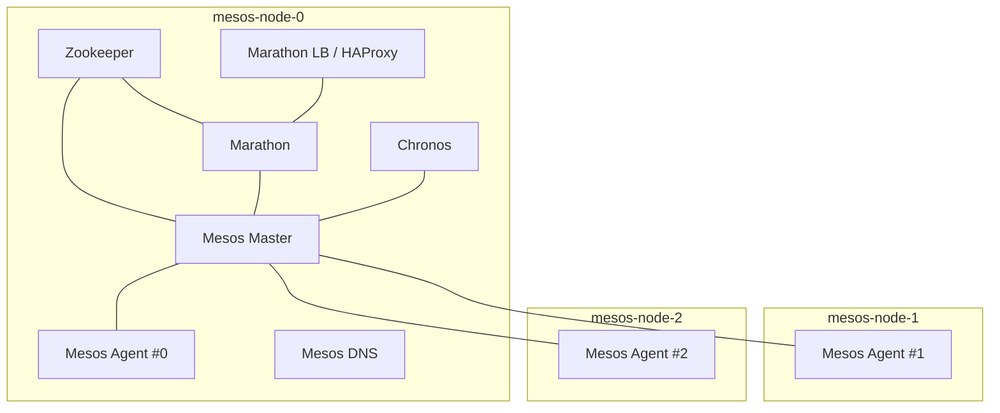

# Mesos Cluster

Scripts to configure a Mesos cluster using Mesos and Mesosphere components.
The main features are:

 - Mesos master running the Marathon and Chronos frameworks
 - Mesos agent with Docker containerizer
 - Mesos DNS for core service discovery
 - Marathon load balancer using HAProxy for SSL and proxying to internal
   applications



## Usage

To use the scripts to build a custom Mesos cluster include the following two
files in your DevOps setup. The first one allows you to include the roles in
your project by invoking:

    $ ansible-galaxy install -r requirements.yml

`requirements.yml`:
```yaml
- src: https://github.com/ypg-data/mesos-stack
  scm: git
  name: mesos-stack
  path: .
```

The second file tells Ansible to load roles from the roles directory provided by
this project.

`ansible.cfg`:
```ini
[defaults]
roles_path = mesos-stack/roles
```
