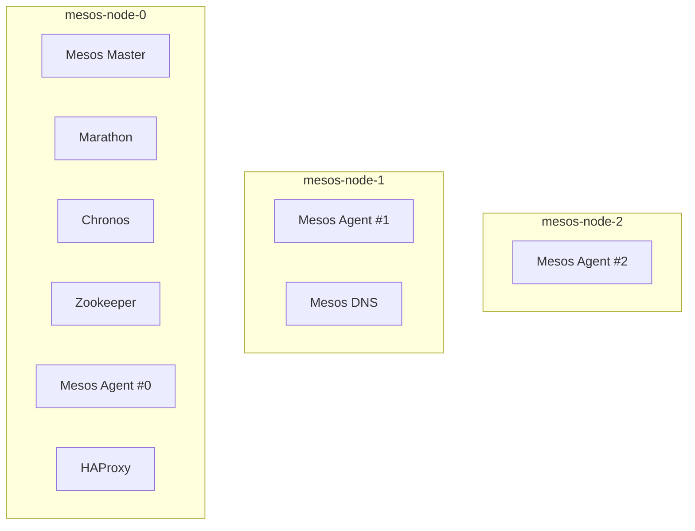

# Roles

Each component is mapped to an Ansible role. Nodes in the cluster can have
multiple roles and responsibilities.

```mermaid
graph TB;

subgraph mesos-node-2
  MesosAgent2[Mesos Agent #2]
end

subgraph mesos-node-1
  MesosAgent1[Mesos Agent #1]
  MesosDNS[Mesos DNS]
end

subgraph mesos-node-0
  MesosMaster[Mesos Master]
  Marathon
  Chronos
  Zookeeper
  MesosAgent0[Mesos Agent #0]
  HAProxy
end
```
